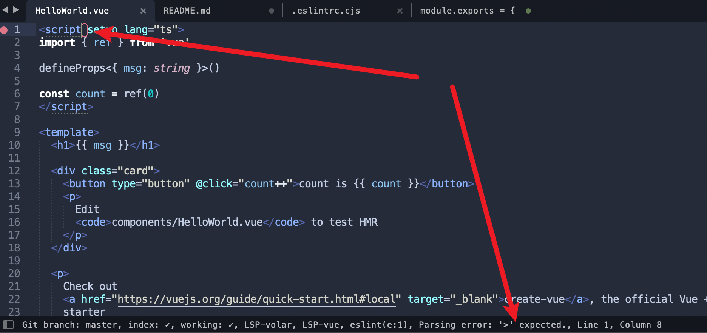

[back](../../README.md)

### Parsing error: '>' expected.

You may find you eslint lint tell you `Parsing error: '>' expected.`



Just modifiy you `eslint.cjs` file like this:

```javascript
module.exports = {
  // ...
  parser: 'vue-eslint-parser',
  parserOptions: {
    // ...
    parser: '@typescript-eslint/parser',
    // ...
  },
  // ...
}
```

Then everything will be fine
