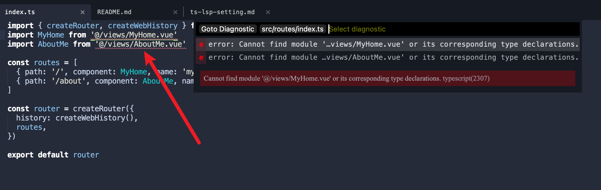
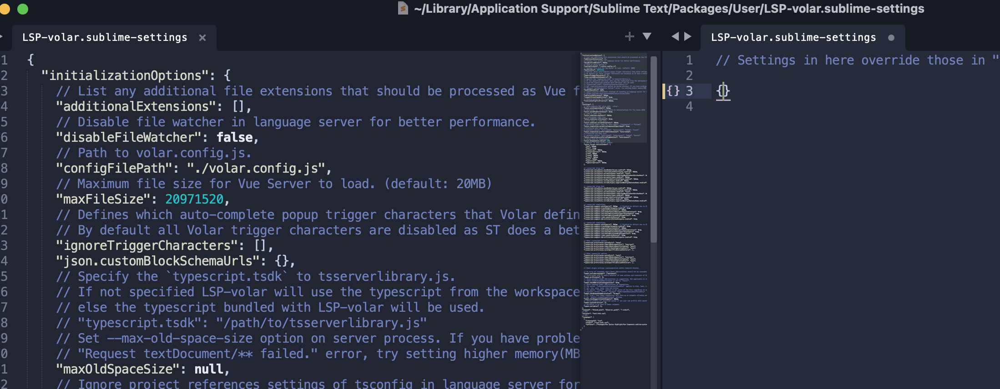
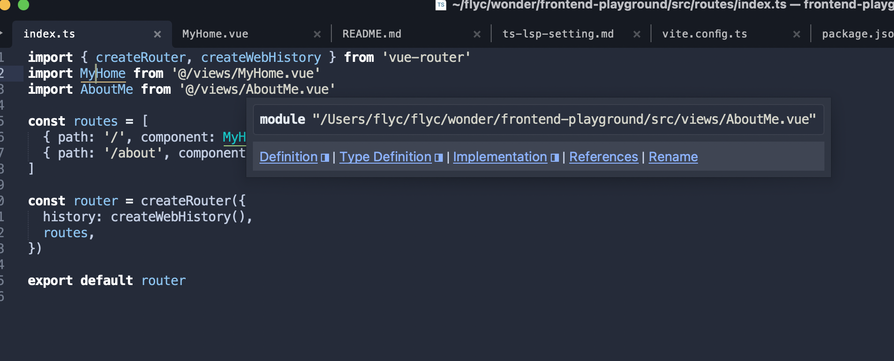

[back](../../README.md)

### Cannot Jump to Vue file in typescript file

> TL;DR [https://github.com/sublimelsp/LSP-volar](https://github.com/sublimelsp/LSP-volar#enable-for-non-vue-files)

> We use [LSP][lsp] and [LSP-typescript][lsp-typescript] as our default LSP server and typescript language server protocol

If we import some `.vue` files in `.ts` file, like router file.  
You may find that there are some `LSP` error hints like this in your `.ts` file:



Then, of course, when you use `F12`, which is the `lsp_symbol_definition` command, and try to jump to the definition of the file, it will not work.

#### Before we explain why

You may check the `alias` first:

The `alias` of `typescript`, which means `paths` and `baseUrl` in `tsconfig.json` is setting correct or not.

```json
{
  // ...
  "compilerOptions": {
    "baseUrl": ".",
    "paths": {
      "@/*": ["./src/*"]
    }

    // ...
  }
  // ...
}
```

Then, due to we don't want to write the same alias again in our `vite.config.ts` file, we're going to `vite-tsconfig-paths` to help us

```bash
pnpm install --save-dev vite-tsconfig-paths
```

After install package, modify the `vite.config.ts` like this:

```ts
// vite.config.ts
// ...
import ViteTsconfigPaths from 'vite-tsconfig-paths'

export default defineConfig({
  plugins: [
    // ...
    vue(),
    ViteTsconfigPaths(),
    // ...
  ],
})
```

the package `vite-tsconfig-paths` will sync the setting of `tsconfig.json` and we don't have to rewrite the alias again.

If the `alias` is setting correctly and the problem is gone. congratulation 🎉

but if it's not, let's keep going.

#### After setting alias correctly

Your `build` or `dev` command may work perfectly without setting extra `alias` in `vite.config.ts`, because it has been set in the `tsconfig.json` and package `vite-tsconfig-paths` help us sync that.

But even we settle them all well done, it seems that the `lsp-typescript` seems not recognized `.vue` file. So we have to change the `lsp` language from `typescript` to `vue`, which is [LSP-volar][lsp-volar]

Here is the [stackoverflow](https://stackoverflow.com/a/73710755/4551134)

Eventhough the answer is for `vscode`, but we can do the same things in sublime text:

##### 1. Disable build-in typescript language server protocol

For sublime text, due to we don't have some 'build-in' language server, it is just the [LSP-typescript][lsp-typescript] we installed by ourselves, so all we have to do is uninstall or disable it.

##### 2. Install [LSP-volar][lsp-volar]

##### 3. Let volar do the language things for `.ts` extension. (default behavior in vscode)

Use `cmd+shift+p` open panel, input `preferences: LSP-volar Settings` to open setting files side-by-side



Input these selector settings:

```javascript
{
  // ...
  "selector": "text.html.vue | source.ts | source.tsx | source.js | source.jsx"
  // ...
}
```

Then, everything will be fine.



> Don't forget to restart lsp server after doing all these things

[lsp]: https://github.com/sublimelsp/LSP
[lsp-typescript]: https://github.com/sublimelsp/LSP-typescript
[lsp-volar]: https://github.com/sublimelsp/LSP-volar
